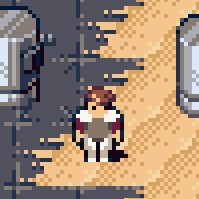

# Ryan Lee Sipes

    <ul class="fa-ul">
        <li><i class="fa-li fa fa-briefcase"></i>Community and Business Development Manager for <a href="https://thunderbird.net">Mozilla Thunderbird</a></li>
        <li><i class="fa-li fa fa-birthday-cake"></i> Years Old</li>
        <li><i class="fa-li fa fa-map-marker"></i>Lives in <a href="https://goo.gl/maps/K4Gtr3aXkzxNCPjr8">Salida, CO</a></li>
    </ul>

## Projects

I lend my time and talents to a few projects. Check them out!

|  |  |
|---|---|---|
| [Thunderbird](https://thunderbird.net) | [Last Peacekeeper](https://lispysnake.com/the-last-peacekeeper/) |

## Find Me Online

### Work + Code

I contribute to some projects and documentation on GitHub.

<a href="https://github.com/ryanleesipes" class="read-more github"><i class="fab fa-fw fa-github"></i>Browse code on GitHub</a>

<a href="/resume" class="read-more resume"><i class="far fa-fw fa-file-alt"></i>See résumé</a>

### Writing

Follow my day-to-day musings via my blog, Twitter, or Mastodon.

<a href="https://blog.ryanleesipes.me" class="read-more blog"><i class="fas fa-fw fa-blog"></i>Read posts on blog</a>

<a href="https://twitter.com/ryanleesipes" class="read-more twitter"><i class="fab fa-fw fa-twitter"></i>See tweets</a>

<a rel="me" href="https://mastodon.social/@ryanleesipes" class="read-more mastodon"><i class="fab fa-fw fa-mastodon"></i>Follow on Mastodon</a>

### Playing

I don't play a lot of games lately, but sometimes you can catch me online!

<a href="http://psnprofiles.com/TeamSipes" class="read-more psn"><i class="fa fa-fw fa-trophy"></i>See PSN profile</a>

<a href="http://steamcommunity.com/id/ryanleesipes/" class="read-more steam"><i class="fab fa-fw fa-steam-square"></i>Add on Steam</a>
